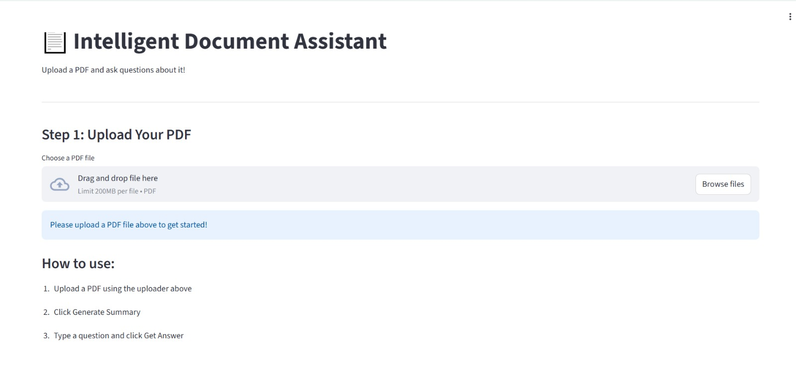
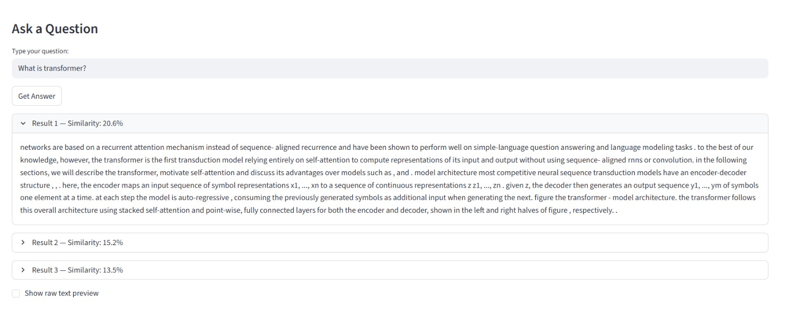
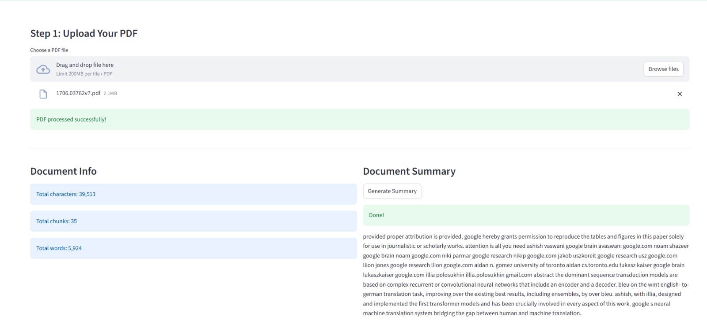

# 📄 Intelligent Document Assistant

A powerful RAG (Retrieval Augmented Generation) system that reads PDF documents and answers questions about them intelligently!

---

## 🎯 What It Does

- 📂 Upload any PDF document
- 📝 Automatically extracts and processes text
- 🔍 Answers questions about the document
- 📋 Generates smart summaries
- 🔎 Finds relevant sections instantly

---

## 🏗️ Project Architecture
```
PDF Upload
    ↓
Text Extraction (PyMuPDF)
    ↓
NLP Preprocessing (NLTK)
    ↓
Text Chunking
    ↓
TF-IDF Vectorization (Scikit-learn)
    ↓
FAISS Vector Database
    ↓
User Question → Search → Answer!
```

---

## 🛠️ Technologies Used

| Technology | Purpose |
|---|---|
| Python | Core programming language |
| PyMuPDF | PDF text extraction |
| NLTK | NLP preprocessing |
| HuggingFace | Sentence embeddings |
| FAISS | Vector similarity search |
| TF-IDF | Document retrieval |
| Scikit-learn | Machine learning |
| Streamlit | Web application UI |
| Google Colab | Development platform |

---

## 📅 Development Timeline

### Day 1 — Data Pipeline
- PDF text extraction
- NLP preprocessing
- Text cleaning and tokenization
- Document chunking
- HuggingFace embeddings
- FAISS vector database

### Day 2 — AI Models
- TF-IDF search engine
- Q&A retrieval system
- Document summarization
- Interactive Q&A loop

### Day 3 — Web Application
- Streamlit UI
- PDF upload feature
- Real-time Q&A
- Document summary generation
- GitHub deployment

---

## 🚀 How to Run

### Step 1 - Install Requirements
```
pip install streamlit pymupdf nltk scikit-learn numpy faiss-cpu sentence-transformers
```

### Step 2 - Run the App
```
streamlit run app.py
```

### Step 3 - Use the App
```
1. Upload your PDF
2. Click Generate Summary
3. Type your question
4. Click Get Answer
```

---

## 📊 Features

- ✅ Works with any PDF document
- ✅ Fast document search
- ✅ Accurate Q&A system
- ✅ Smart summarization
- ✅ Beautiful web interface
- ✅ No internet required after setup

---

## 📸 Demo

Upload any PDF → Ask questions → Get instant answers!

Example questions:
- "What is the main topic?"
- "What are the key findings?"
- "What is the conclusion?"

---

## 👩‍💻 Developer

- **Name:** Afsana
- **Project:** Intelligent Document Assistant
- **Type:** NLP + Deep Learning + RAG System

---

## 📚 References

- Attention Is All You Need (Vaswani et al., 2017)
- HuggingFace Transformers
- FAISS by Facebook AI
- Streamlit Documentation

  ## Screenshots

### App Homepage


### Q&A Working


### Summary

